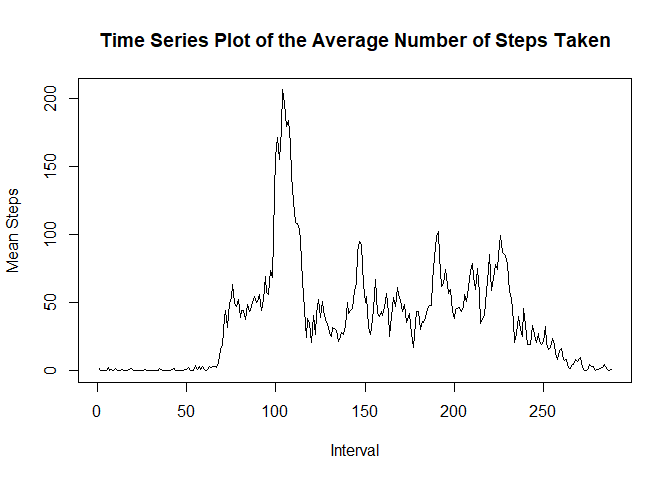
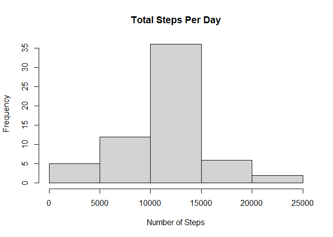

# Reproducible Reaserch Course Project 1

## Introduction

It is now possible to collect a large amount of data about personal movement using activity monitoring devices such as a Fitbit, Nike Fuelband, or Jawbone Up. These type of devices are part of the “quantified self” movement – a group of enthusiasts who take measurements about themselves regularly to improve their health, to find patterns in their behavior, or because they are tech geeks. But these data remain under-utilized both because the raw data are hard to obtain and there is a lack of statistical methods and software for processing and interpreting the data.

This assignment makes use of data from a personal activity monitoring device. This device collects data at 5 minute intervals through out the day. The data consists of two months of data from an anonymous individual collected during the months of October and November, 2012 and include the number of steps taken in 5 minute intervals each day.

The variables included in this dataset are:

steps: Number of steps taking in a 5-minute interval (missing values are coded as NA)
date: The date on which the measurement was taken in YYYY-MM-DD format
interval: Identifier for the 5-minute interval in which measurement was taken
The dataset is stored in a comma-separated-value (CSV) file and there are a total of 17,568 observations in this dataset.

This documents shows my code for Coursera's Reproducible Reaserch Course Project 1.

## 1. Unzipping and loading the file

The first thing I am going to do is to unzip the file containg the data set 
needed for this project and read its content to a data set:


```r
unzip("activity.zip")
df <- read.csv("activity.csv")
```

## 2. Histogram of the total number of steps taken each day

In this section I will create a histogram of the total number of steps taken 
each day.


```r
histdata <- tapply(df$steps, df$date, sum)
hist(histdata, main = "Total Steps Per Day", xlab = "Number of Steps")
```

<!-- -->

## 3. Mean and median number of steps taken each day

In this part I'll calculate the mean and median number of steps taken each day:


```r
meanStepsPerDay <-  mean(tapply(df$steps, df$date, sum), na.rm = TRUE)
medianStepsPerDay <-  median(tapply(df$steps, df$date, sum), na.rm = TRUE)
cat("The mean number of steps each day is ", meanStepsPerDay, ".\n", sep = '')
```

```
## The mean number of steps each day is 10766.19.
```

```r
cat("The median number of steps each day is ", medianStepsPerDay, ".\n", 
    sep = '')
```

```
## The median number of steps each day is 10765.
```

## 4. Time series plot of the average number of steps taken

In this section I will create a time series plot of the average number of steps 
taken:


```r
meanStepsPerInterval <- tapply(df$steps, df$interval, mean, na.rm = TRUE)
plot(meanStepsPerInterval, type="l", xlab = "Interval", 
     ylab = "Mean Steps", 
     main = "Time Series Plot of the Average Number of Steps Taken")
```

<!-- -->


## 5.The 5-minute interval that, on average, contains the maximum number of 
## steps

In this section I will find the 5-minute interval that, on average, 
contains the maximum number of steps:


```r
cat("The 5-minute interval that contains, on average the maximum number of steps
    is ", which.max(meanStepsPerInterval), ".\n", sep = '')
```

```
## The 5-minute interval that contains, on average the maximum number of steps
##     is 104.
```


## 6. Code to describe and show a strategy for imputing missing data

In this section I will impute missing data.
first of all, let's see how many rows have missing data (for each column):


```r
cat("The number of missing values in the steps column is ",sum(is.na(df$steps)),
    ".\n", sep = '')
```

```
## The number of missing values in the steps column is 2304.
```

```r
cat("The number of missing values in the date column is ",sum(is.na(df$date)), 
    ".\n", sep = '')
```

```
## The number of missing values in the date column is 0.
```

```r
cat("The number of missing values in the interval column is ",
    sum(is.na(df$interval)), ".\n", sep = '')
```

```
## The number of missing values in the interval column is 0.
```

We can see that the only column that has missing values is the steps column, and
therefore this is the only column with missing values to inpute.
I decided to use the mean steps per interval to fill in these missing data.
Here is the code to perform this task, and create a new dataset (called dfnew)
with no missing
values:


```r
dfnew <- df
for (i in unique(dfnew$interval)){
  dfnew$steps[is.na(dfnew$steps) & dfnew$interval == i] <- 
    round(mean(dfnew$steps[dfnew$interval == i], na.rm = TRUE))
}
```

We can check that indeed there are no missing values in the new data set by 
using the following code:


```r
cat("The number of missing values in the dfnew steps column is "
    ,sum(is.na(dfnew$steps)),".\n", sep = '')
```

```
## The number of missing values in the dfnew steps column is 0.
```

```r
cat("The number of missing values in the dfnew date column is "
    ,sum(is.na(dfnew$date)), ".\n", sep = '')
```

```
## The number of missing values in the dfnew date column is 0.
```

```r
cat("The number of missing values in the dfnew interval column is ",
    sum(is.na(dfnew$interval)), ".\n", sep = '')
```

```
## The number of missing values in the dfnew interval column is 0.
```

## 7. Histogram of the total number of steps taken each day after missing values are 
## imputed

In this section I will plot a histogram of the total number of steps taken each day after missing values are imputed:


```r
histdatanew <- tapply(dfnew$steps, df$date, sum)
hist(histdatanew, main = "Total Steps Per Day", xlab = "Number of Steps")
```

<!-- -->

Now I'll compare the mean and median of steps created by the new data set to see
the impact of imputing the missing data:


```r
meanStepsPerDayNew <-  mean(tapply(dfnew$steps, df$date, sum))
medianStepsPerDayNew <-  median(tapply(dfnew$steps, df$date, sum))
cat("The mean number of steps each day is ", meanStepsPerDay, ".\n", sep = '')
```

```
## The mean number of steps each day is 10766.19.
```

```r
cat("Therefore, there's an absolute differnce of ", 
    abs(meanStepsPerDayNew - meanStepsPerDayNew), "between the means of the new data set and the old data set with the missing values. \n", sep = '')
```

```
## Therefore, there's an absolute differnce of 0between the means of the new data set and the old data set with the missing values.
```

```r
cat("The median number of steps each day is ", medianStepsPerDay, ".\n", 
    sep = '')
```

```
## The median number of steps each day is 10765.
```

```r
cat("Therefore, there's an absolute differnce of ", 
    abs(medianStepsPerDayNew - medianStepsPerDayNew), "between the medians of the new data set and the old data set with the missing values. \n", sep = '')
```

```
## Therefore, there's an absolute differnce of 0between the medians of the new data set and the old data set with the missing values.
```


## 8.Panel plot comparing the average number of steps taken per 5-minute interval 
## across weekdays and weekends

In this section I will create a panel plot to compare the average steps taken
per 5-minute interval across weekdays and weekends:

The first step is creating a factor variable in the new data set which 
determines whether it's a weekday or a weekend (assuming Saturday and Sunday are
considered weekend)


```r
weekdays1 <- c('Monday', 'Tuesday', 'Wednesday', 'Thursday', 'Friday')
dfnew$partofweek <- factor((weekdays(as.Date(df$date)) %in% weekdays1), 
         levels=c(FALSE, TRUE), labels=c('weekend', 'weekday'))
```

The next step is creating the plot. In order to do that, I'll first calculate 
the mean steps for weekdays and weekends seperatly, and then create the plot:


```r
weekdaysSteps <- tapply(dfnew$steps[dfnew$partofweek=="weekend"], 
                        dfnew$interval[dfnew$partofweek=="weekend"], mean)
weekendSteps <- tapply(dfnew$steps[dfnew$partofweek=="weekend"], 
                        dfnew$interval[dfnew$partofweek=="weekend"], mean)
par(mfrow = c(2,1))
plot(weekdaysSteps, type="l", xlab = "Interval", 
     ylab = "Mean Steps", 
     main = "Time Series Plot of the Average Number of Steps Taken on Weekdays")
plot(weekendSteps, type="l", xlab = "Interval", 
     ylab = "Mean Steps", 
     main = "Time Series Plot of the Average Number of Steps Taken on Weekdays")
```

<!-- -->

Thank you for reading.

I hope you enjoyed!
